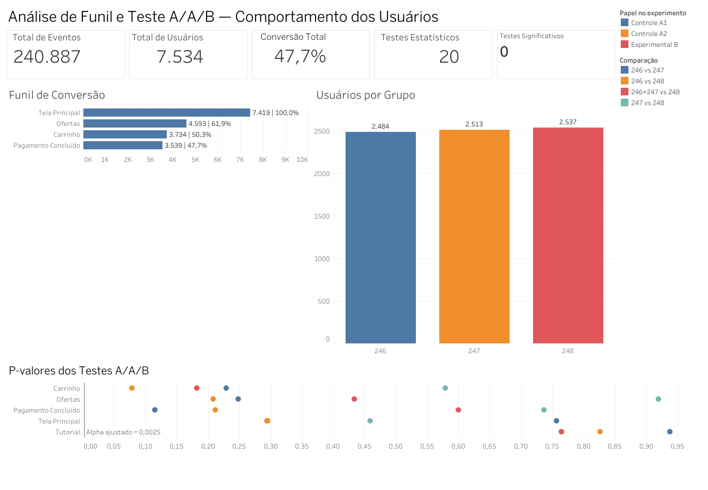

# 📊 Análise de Funil e Teste A/A/B

Projeto de análise de dados desenvolvido para avaliar o comportamento dos usuários de um aplicativo e verificar o impacto de uma alteração de interface por meio de um experimento **A/A/B**.

A análise combina **Python, Pandas, estatística e Tableau**, passando pela preparação dos dados, análise do funil de conversão, validação dos grupos de controle e realização de testes estatísticos.

## 🎯 Objetivo

Os principais objetivos deste projeto foram:

- analisar o comportamento dos usuários dentro do aplicativo;
- identificar as principais etapas do funil de conversão;
- calcular as taxas de conversão entre as etapas;
- verificar a distribuição dos usuários entre os grupos experimentais;
- validar os grupos de controle por meio de teste A/A;
- comparar o grupo experimental com os grupos de controle;
- avaliar se a alteração de interface provocou diferenças estatisticamente significativas.

## 📊 Dashboard



🔗 **Tableau Public:**  
https://public.tableau.com/app/profile/giovani.vitor/viz/AnalisedeFunileTesteAAB/Dashboard-FunileTesteAAB?publish=yes

## 🔎 Principais resultados

A análise considerou:

- **240.887 eventos**
- **7.534 usuários únicos**
- **3 grupos experimentais**
- **20 testes estatísticos**
- **5 testes A/A**
- **15 testes A/B**
- nível de significância ajustado de **0,0025**

### Funil de conversão

O principal fluxo analisado foi:

**Tela Principal → Ofertas → Carrinho → Pagamento Concluído**

| Etapa | Usuários | Conversão desde o início |
|---|---:|---:|
| Tela Principal | 7.419 | 100,0% |
| Ofertas | 4.593 | 61,9% |
| Carrinho | 3.734 | 50,3% |
| Pagamento Concluído | 3.539 | 47,7% |

A maior perda de usuários ocorreu entre a **Tela Principal e a tela de Ofertas**.

A conversão total da primeira etapa até o pagamento concluído foi de aproximadamente **47,7%**.

## 🧪 Experimento A/A/B

Os usuários foram divididos nos seguintes grupos:

| Grupo | Papel | Usuários |
|---|---|---:|
| 246 | Controle A1 | 2.484 |
| 247 | Controle A2 | 2.513 |
| 248 | Experimental B | 2.537 |

Os grupos apresentaram tamanhos semelhantes, permitindo realizar comparações entre eles.

Primeiro, os grupos **246 e 247** foram comparados por meio de testes A/A para verificar a consistência dos grupos de controle.

Em seguida, foram realizadas comparações entre:

- 246 vs 248
- 247 vs 248
- 246 + 247 vs 248

Foram realizados **20 testes estatísticos** no total.

Para reduzir o risco de falsos positivos devido às múltiplas comparações, foi utilizado um nível de significância ajustado de:

**α = 0,0025**

Nenhum dos testes apresentou resultado estatisticamente significativo.

## 📌 Conclusões

Os resultados indicaram que não houve evidência estatística suficiente para afirmar que a alteração de interface testada modificou significativamente o comportamento dos usuários.

O principal ponto de atenção identificado foi o início do funil, principalmente a transição entre a **Tela Principal e a tela de Ofertas**, onde ocorreu a maior perda proporcional de usuários.

Essa etapa representa uma oportunidade para futuras análises relacionadas à experiência do usuário, navegação e apresentação das ofertas.

## 🛠️ Tecnologias utilizadas

- Python
- Pandas
- NumPy
- Matplotlib
- Seaborn
- Statsmodels
- Jupyter Notebook
- Tableau Public
- Git
- GitHub

## 📁 Estrutura do repositório

```text
funnel-aab-test-analysis/
│
├── funil_aab_analysis_portfolio.ipynb
│
├── dashboard/
│   ├── dashboard_funil_aab.png
│   └── tableau_link.txt
│
└── README.md
```

## 📓 Notebook

O notebook completo contém:

- exploração inicial dos dados;
- tratamento de registros duplicados;
- análise temporal;
- análise dos eventos;
- construção do funil;
- análise dos grupos experimentais;
- testes A/A;
- testes A/B;
- correção para múltiplos testes;
- conclusões e recomendações.

➡️ [`funil_aab_analysis_portfolio.ipynb`](funil_aab_analysis_portfolio.ipynb)

---

### Autor

**Giovani Vitor Gabriel Oliveira**

[LinkedIn](https://www.linkedin.com/in/giovani-vitor-4b04172a3/) | [GitHub](https://github.com/GiovaniVitor1)
